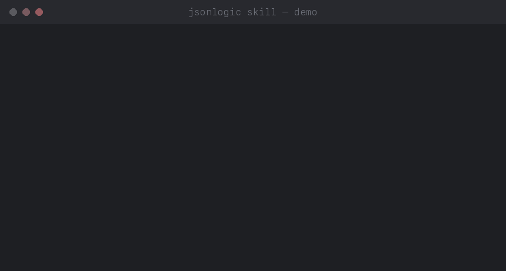

# JsonLogic Skill

Helps with [JsonLogic](https://jsonlogic.com).

[](https://agentskills.io)



## Install

**Claude Code:**

```bash
git clone https://github.com/valeryia-piatrova/jsonlogic-skill.git ~/.claude/skills/jsonlogic
```

Restart Claude Code to pick it up.

**Every install path differs by client** — each badge below jumps to that client's
exact command in [docs/installing.md](docs/installing.md):

[](docs/installing.md#cursor)
[](docs/installing.md#github-copilot)
[](docs/installing.md#vs-code)
[](docs/installing.md#codex)
[](docs/installing.md#gemini-cli)

## What It Does

Claude uses this skill automatically when JsonLogic comes up.

- Turn a plain logic description into a JsonLogic rule
- Run JsonLogic rule
- Validate if a JsonLogic rule is valid
- Debug a JsonLogic rule that isn't working

## Usage

**No data shape given:**

> Give a 20% discount on orders over $200, or 10% over $100 — otherwise no discount

> Approve a claim only if the policy is active and the incident happened after the policy start date — but route it to manual review instead if the policyholder already has 2+ claims this year, or if the amount is over the coverage limit

> Let a user edit a document if they’re the owner or an admin, but only while the document isn’t locked for review

> Flag a transaction as suspicious if it’s over $5,000 and happens outside business hours — unless the account has 90+ days of history and no prior flags, in which case just log it instead of blocking

**Data shape given — field names come from it, not a guess:**

> Approve a claim, but route it to manual review instead of auto-approving if the policyholder already has 2+ claims this year or the amount is over the limit. My claim data:
>
> ```json
> {
> 	"policy_active": true,
> 	"incident_date": "2026-01-01",
> 	"policy_start_date": "2025-01-01",
> 	"claims_this_year": 1,
> 	"claim_amount": 4200,
> 	"coverage_limit": 5000
> }
> ```

> Explain what this JsonLogic rule does:
>
> ```json
> {
> 	"some": [
> 		{ "var": "items" },
> 		{ ">": [{ "var": "price" }, 500] }
> 	]
> }
> ```

> Run this JsonLogic rule in Ruby:
>
> ```json
> {
> 	">=": [{ "var": "age" }, 18]
> }
> ```

> Why does this rule return `false` when I expect  `true`?
>
> ```json
> {
> 	"rule": { "and": [
> 		{ ">": [{ "var": "total" }, 100] },
> 		{ "==": [{ "var": "vip" }, true] }
> 	]},
> 	"data": { "total": 150, "vip": "true" }
> }
> ```

Uses operators from the real standard. Checks whether standard and
library actually supports needed logic and says so plainly if it doesn't.

## Learn More

- [jsonlogic.com](https://jsonlogic.com) — the standard this skill implements
- [`SKILL.md`](SKILL.md) — full workflow and reasoning

## License

MIT — see [`LICENSE`](LICENSE).
